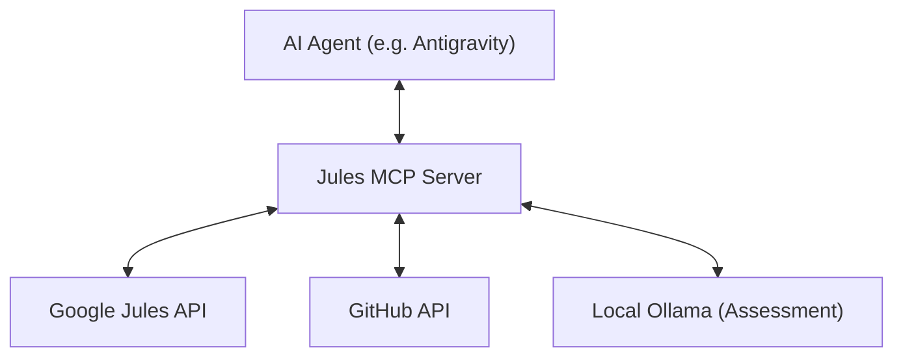

# Jules MCP Server - Implementation Plan

## Objective
To build a Model Context Protocol (MCP) server that exposes the Jules automation capabilities as standardized tools. This will allow any MCP-compatible AI agent (like Antigravity or Claude) to interact with Jules sessions, send messages, and automate code review loops directly from their environment.

## Architecture

## Proposed Tools

### 🏗️ Session Management
- `jules_create_session`: Creates a new Jules session.
    - Args: `prompt`, `source_id`, `branch`, `title`.
- `jules_list_sessions`: Retrieves a list of recent sessions.
- `jules_get_status`: Returns the current state and outputs of a session.

### 💬 Interaction
- `jules_send_message`: Sends a follow-up prompt to an active session.
- `jules_get_activities`: Retrieves the internal interaction log for a session.

### 🔍 Automated Reviews
- `jules_process_reviews`: A high-level tool that fetches PR reviews, assesses them via Ollama, and sends fix requests to Jules.
    - Args: `pr_number`, `session_id`.

## Technology Stack
- **Language**: Python 3.10+
- **SDK**: `mcp` Python library (Standard IO or SSE).
- **Storage**: `.jules_state.json` for persistent state tracking.
- **Config**: Environment variables (.env).

## Implementation Roadmap

### Phase 1: Foundation
- Scaffold the MCP server structure.
- Define the `Tool` schemas for session creation and status.
- Implement basic stdio communication.

### Phase 2: Core Logic Integration
- Port `JulesAutomator` methods into MCP tool handlers.
- Implement robust error handling for API failures.

### Phase 3: Advanced Automation
- Implement the review processing tool.
- Add support for Ollama-based pre-processing.

### Phase 4: Verification & USAGE
- Test with local MCP clients (e.g., inspector).
- Create `USAGE_MCP.md`.
